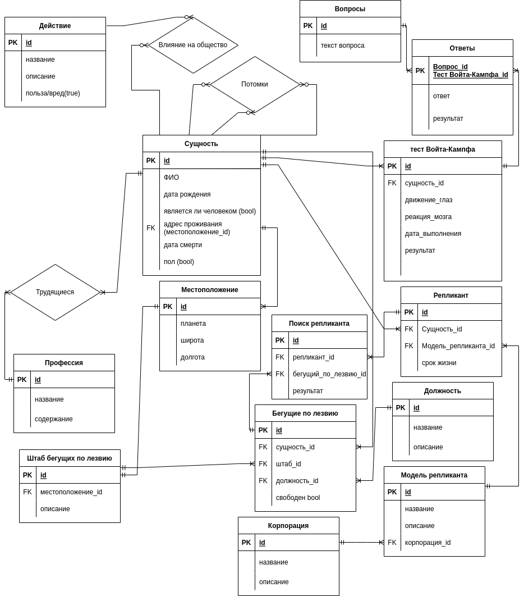
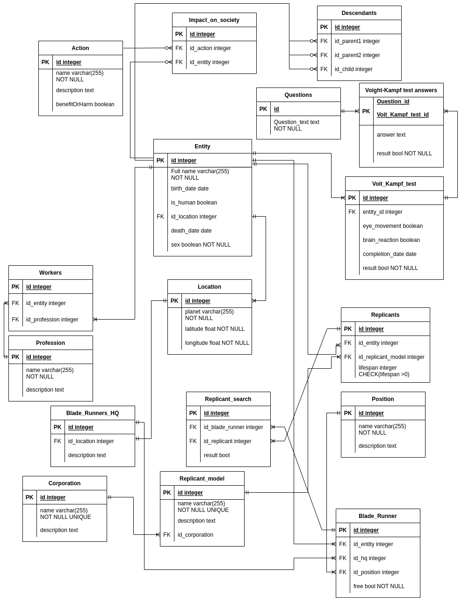

<h3> Курсовая работа по Информационным системам и базам данных </h3>

<h4>Текст задания: </h4>

<h5>Требования к ER-модели и БД: </h5>

1. ER-модель должна соответствовать представленному описанию предметной области.

2. ER-модель базы данных должна включать в себя не менее 10 сущностей, содержать
хотя бы одно отношение «многие-ко-многим».

3. В качестве СУБД должна использоваться СУБД PostgreSQL. Для реализации БД и
вспомогательных средств должны использоваться языки SQL и PL/pgSQL База данных
должна быть развернута на сервере helios.

4. Веб-приложение, использующее разработанную базу данных, должно быть развернуто
на сервере helios.

5. Взаимодействие с БД/запуски запросов и скриптов должны осуществляться через psql.

<h5>Этап 1</h5>

* Выбрать предметную область для дальнейшего построения базы данных и вебприложения.
* Согласовать предметную область с преподавателем.
* Сделать подробное описание предметной области.

<h5>Этап 2</h5>

* Нарисовать ER-диаграмму предметной области. ER-модель должна соответствовать
описанию, представленному в рамках первого этапа курсовой работы.
* На основе ER-модели построить даталогическую модель.

<h5>Этап 3</h5>

Реализовать даталогическую модель в реляционной СУБД PostgreSQL:
* Создать необходимые объекты базы данных.
* Заполнить созданные таблицы тестовыми данными.
* Сделать скрипты для:
    * создания/удаления объектов базы данных;
    * заполнения/удаления созданных таблиц.
* Обеспечить целостность данных при помощи средств языка DDL.
* Добавить в базу данных триггеры для обеспечения комплексных ограничений
целостности.
* Реализовать функции и процедуры на основе описания бизнес-процессов (из этапа
№1).
* Произвести анализ использования созданной базы данных:
    * выявить наиболее часто используемые запросы к объектам базы данных;
    * результаты представить в виде текстового описания. 
* Создать индексы и доказать, что они полезны для вашей базы данных:
    * доказательство должно быть приведено в виде текстового описания.

<h5>Этап 4</h5>

* Использовать разработанную базу данных в качестве уровня хранения вебприложения.
* Приложение должно реализовывать бизнес-процессы (или их часть — по
согласованию с преподавателем), описанные в рамках первого этапа кр.
* Технологическая основа приложения согласовывается с преподавателем (до
реализации приложения).

<h4>Выполнение: </h4>
<h5>Этап 1</h5>

<b>Тема: Blade Runner

«Бегущий по лезвию»:

<h5>Описание предметной области:</h5>

2019 год. Мир пережил ядерный войну и люди занимаются колонизацией близлежащих миров. Жесткое классовое разделение, на земле остались не лучшие слои населения. Главным предмета роскоши для человека стали животные, их практически не осталось, поэтому многие покупают себе искусственных.
Репликанты(искусственные люди) помогают человечеству в освоении космоса. Их срок жизни ограничен - 4 года. Так выходит, что некоторые репликанты узнают об этом, сбегают с колоний на землю, оставляя за собой хаос и трупы. На земле они надеются найти спасение и снять ограничение на 4 года. Бегущие по лезвию вылавливают сбежавших репликантов. Проблема в том, что репликанты практически не отличаются от человека - разве что только сильнее физически и на некоторых частях тела или органах выбит серийный номер. Для определения кто есть кто придумали тест Войта-Кампфа - он построен на эмпатии, если в ходе теста выясняется, что человек ее не испытывает, значит он репликант. Все бы ничего, но после black out 2022 база данных рухнула, люди и репликанты перемешались, производство репликантов прекратилось на десятилетие. После 2036 года производство Nexus возобновляют, но уже обновленное - репликанты полностью подвластны человеку и живут ровно столько, сколько захочет хозяин. Получается в 2049 году в обществе остались репликанты, выпущенные до 2022 года и срок жизни которых не ограничен. Они стали частью общества, социализировались, стали практически людьми. Многие из них построили семью и даже завели детей. Но может ли репликант родить ? А если да, то кого ? Именно эти вопросы мы и будем решать.
Также мы будем вести поиск репликантов и следить за их поведением в обществе.

Примеры бизнес процессов на основе проблем, которые необходимо решить:
1. Поиск репликантов и ведение статистики.
Поступает запрос на получение информации о репликанте/человеке, после чего собирается общая информация в зависимости от того, человек это или репликант.
В случае если это человек, собирается информация, в том числе: место жительства, дата рождения, результаты тестов Войта-Кампфа, какая у него профессия, какие важные действия он совершил за свою жизнь и так далее.
В случае если известно, что это репликант, то собирается информация: серийный номер, модель место жительства, дата рождения(производства). Если необходимо его устранить, то выбирается свободный сотрудник из штата бегущих по лезвию из соответствующего города. Сотруднику направляется запрос, в котором собрана вся необходимая для поимки репликанта информация: местоположение объекта, его должность и так далее. При успешном выполнении задания сотрудник может отправить запрос на изменение статуса репликанта в базе данных в зависимости от исхода операции.
При получении запроса на добавление или пополнение информации о существующем репликанте/человеке, добавляется новый объект или обновляется информация о старом. При добавлении проверяются зависимости с существующими объектами и пополняется информация про древо отношений объектов.

2. Очеловечивание репликантов.
Поступает запрос на отслеживание очеловечивания конкретного объекта, из таблицы достается информация об истории результатов прохождения теста Войта- Кампфа за все время, а также его действия. Получивший эти данные эксперт сможет оценить их и собрать критерий оценки очеловечивания, который впоследствии может повлиять на понимание роли репликантов в обществе.

3. Контроль за эволюцией на стыке искусственного и живого.
Необходимо вести статистику за тем, что или кто является потомком у репликанта/человека. В случае, если оказывается, что есть союз репликанта/человека, репликанта/репликанта и у этого союза есть ребенок - его необходимо найти по местоположению его родителей и информации о их родственниках/близких людях (либо же по информации ребенка, если она есть) и доставить ребенка в корпорацию для изучения, даже если это уже взрослая особь.

<h5>Этап 2</h5>

Инфорологическая модель:

Даталогическая модель:

<h5>Этап 3</h5>

Скрипты для создания, удаления таблиц, триггеров, функций, индексов:
[тут](./database).

